# Phone Controlled Robotic Arm

The phone-controlled robotic arm is a 3-jointed arm with a rotating base. It has 4 rotational degrees of freedom; the bottom which allows the robot to rotate left and right, the 2 joints in the arm that will enable the arm to bend up and down, and the claw which can open and close. It can be controlled using a wired controller with 2 joysticks or a mobile app that can control the robot with buttons without the user physically touching it. My biggest challenge was coding both my Arduino Nano and my mobile app so that they could communicate with each other via a Bluetooth module. This is because my coding skills weren't solid, and I had never dealt with anything remotely close to Bluetooth. I was also coding in C++, a language I had never coded in before. But I persevered and with the help of some of my Bluestamp instructors, I could finish the app and Arduino code and get it all to function within a week. My biggest takeaway was that I could really learn and do so much by jumping into new things that were scary and uncomfortable because I would eventually figure things out. My biggest triumph was being able to code my voice control in C++ with pretty much no outside help at all.


| **Engineer** | **School** | **Area of Interest** | **Grade** |
|:--:|:--:|:--:|:--:|
| Linus F | Aragon High School | Mechanical Engineering | Incoming Freshman

<!---**Replace the BlueStamp logo below with an image of yourself and your completed project. Follow the guide [here](https://tomcam.github.io/least-github-pages/adding-images-github-pages-site.html) if you need help.**-->

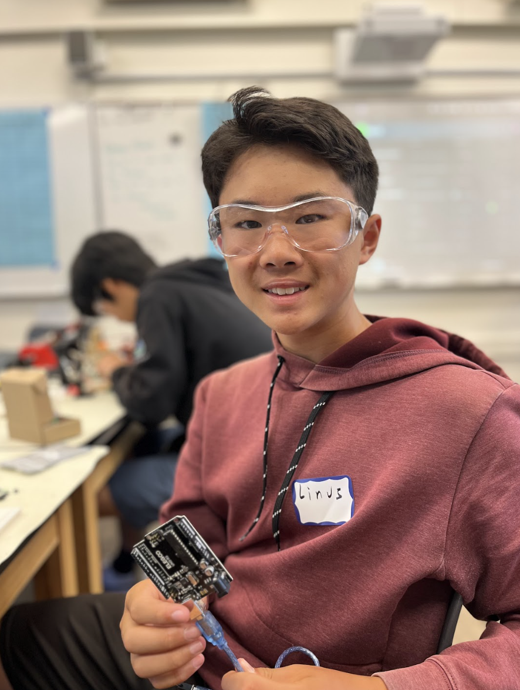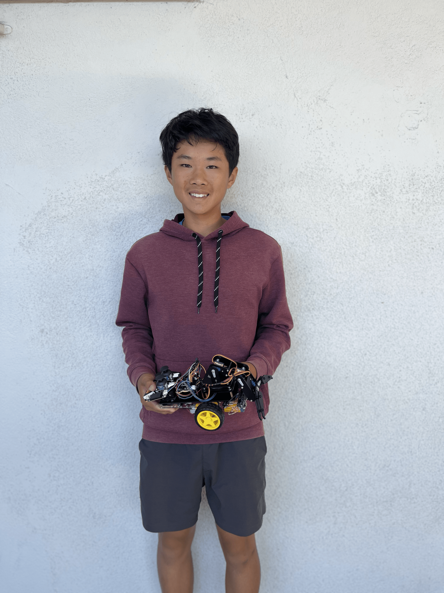
  
# Second Modification

<iframe width="560" height="315" src="https://www.youtube.com/embed/dnNP3EXICmc?si=2tmOGjXiVf8oe8Vo" title="YouTube video player" frameborder="0" allow="accelerometer; autoplay; clipboard-write; encrypted-media; gyroscope; picture-in-picture; web-share" referrerpolicy="strict-origin-when-cross-origin" allowfullscreen></iframe>

## Summary

My modification was putting my robotic arm on a car. It used 2 motors and I used a motor driver to control them. I could use both Bluetooth and voice control to make the car go forward, backward, turn left, and turn right.

## Components used

- 1 Chassis: Provide a base for the arm to sit on
- 2 Wheels: Allow the car to move
- 2 Velocimetry Code Wheels
- 2 DC Gear Motors: Spin the wheels to move the car
- 1 9 Volt Battery: Power the car
- 1 Universal Wheel: Third wheel to balance the car
- 1 Switch: Turn the battery on and off in the car
- Screws, Nuts, Fasteners, and Spacers: Hold the car together
- Velcro and Hot Glue: Hold the battery, motor driver, and arm to the chassis
- 1 L298N Motor Driver: Control the motors

## Challenges Faced

The biggest challenge that I faced was having almost no pins in my Arduino Nano or Arduino Shield to control the motor. I fixed this challenge by moving around some pins and different methods in the software to control the speed of my motors instead of just plugging them into pins that I didn't have.

## Next Steps

My next steps are going to be practicing and preparing for Demo night and finishing up my portfolio.

# First Modification

<iframe width="560" height="315" src="https://www.youtube.com/embed/jsjIlLcYMIU?si=YCobMqWf_-OzjrIw" title="YouTube video player" frameborder="0" allow="accelerometer; autoplay; clipboard-write; encrypted-media; gyroscope; picture-in-picture; web-share" referrerpolicy="strict-origin-when-cross-origin" allowfullscreen></iframe>

## Summary

My modification was adding voice control to my robot arm. I used a WS-2520-TR voice recognition module to send my voice to the Arduino. I could tell the arm to move in different directions and could tell it to reset all of its servos to 90 degrees as well. 

## Components Used

- 4 Female-Female Jumper Wires: Connect to WS-2520-TR voice recognition module to the Arduino
- 1 WS-2520-TR Voice Recognition Modules: Recognize my voice and send it to the Arduino

## Challenges Faced

My biggest challenge was with the Arduino software itself. The Arduino software wasn't working on my computer so all the code started bugging in bizarre ways. I spent 3 hours troubleshooting it. But ultimately, I decided to start over and discovered that reinstalling Arduino was the solution.

## Next Steps

My next steps are going to be maybe adding another modification and if I can't, I will prepare and practice for Demo night. I will also clean up my robot so that it looks more visually appealing and the wiring isn't so chaotic.

# Final Milestone

<iframe width="560" height="315" src="https://www.youtube.com/embed/ddody_513Wo?si=dr0Joc5v0mifrqbb" title="YouTube video player" frameborder="0" allow="accelerometer; autoplay; clipboard-write; encrypted-media; gyroscope; picture-in-picture; web-share" referrerpolicy="strict-origin-when-cross-origin" allowfullscreen></iframe>

## Picture

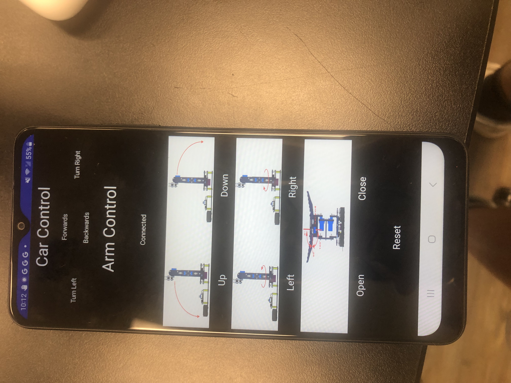

## Summary

My final milestone was making my robot Bluetooth-controlled through an app that I made using MIT App Inventor. There is an HC-05 Bluetooth Module that I added to my robot that will take signals from the phone and send them to the Arduino to make the robot move accordingly.

## Components Used

- 4 Male-Female Jumper Wires: Connect the HC-05 Bluetooth Module to the Arduino Shield
- 1 HC0-5 Bluetooth Module: Receive signals from the Samsung phone and send it to the Arduino
- 1 Samsung Galaxy A03s: Send user inputs to the Arduino Nano via Bluetooth

## Challenges Faced

My biggest challenge was coding my app and Arduino Nano to communicate with each other using a Bluetooth module. My coding skills were pretty shaky to begin with and I had never dealt with coding Bluetooth before. On top of all of that, I was writing code in C++ which is a language I had never used before.

## Next Steps

My next steps are going to be doing a modification to my robot where I can talk to it and use my voice to control it instead of pressing buttons.

# Second Milestone

<!---**Don't forget to replace the text below with the embedding for your milestone video. Go to YouTube, click Share -> Embed, and copy and paste the code to replace what's below.**-->

<iframe width="560" height="315" src="https://www.youtube.com/embed/w3uiwzpNiVI?si=iN_QjuzFOkRXbPA1" title="YouTube video player" frameborder="0" allow="accelerometer; autoplay; clipboard-write; encrypted-media; gyroscope; picture-in-picture; web-share" referrerpolicy="strict-origin-when-cross-origin" allowfullscreen></iframe>

## Summary

My second milestone was finishing assembling my 3 jointed robotic arm and making sure that everything worked properly and there were no bugs in my code. I also built the wired controller so that I could control my robot.

## Components Used

- 8 Female-Female Jumper Wires: Connect the controller to the Arduino Shield
- Wooden Cutouts: Creates the bulk of the physical part of the arm and controller
- Screws, nuts, and columns: Holds together all the parts of the robot and controller
- 3 Servo Arms: Connect the cutouts to the servos so they can move together
- 3 MG90s Servos: Rotate to move the arms of the robot
- Zip Ties and Wire Organizing Tubes: Organize all the wires so they don't interfere with the movement of the arm
- 2 Joysticks: Takes physical input from the user so they can control the robot.

## Challenges Faced

The biggest challenge that I faced was when I used the controller to close the claw of the arm, the claw would close all the way, but the servo would be able to rotate a little bit more so the other servos in the arm would start rotating to try to compensate for the claw not being able to close. The way that I fixed it was by making an if else statement in the code only allowed the claw to close a certain amount.

## Next Steps

I plan on hooking the robot arm up to Bluetooth on a phone so that I can program an app to control the robot remotely.

# First Milestone

<!---**Don't forget to replace the text below with the embedding for your milestone video. Go to YouTube, click Share -> Embed, and copy and paste the code to replace what's below.**-->

<iframe width="560" height="315" src="https://www.youtube.com/embed/v7GNhi7AYkI?si=HWXX6sRTPQ87sU7z" title="YouTube video player" frameborder="0" allow="accelerometer; autoplay; clipboard-write; encrypted-media; gyroscope; picture-in-picture; web-share" referrerpolicy="strict-origin-when-cross-origin" allowfullscreen></iframe>

<!---For your first milestone, describe what your project is and how you plan to build it. You can include:
- An explanation of the different components of your project and how they will all integrate
- Technical progress you've made so far
- Challenges you're facing and solving in your future milestones
- What your plan is to complete your project-->

## Summary

My first milestone was assembling the base of the robotic arm so that I could test it and make sure that the Arduino Nano, the Arduino Shield, the first servo, and the batteries were all working properly. It was also so I could test uploading the code from the Arduino software to the Arduino Nano to make sure that it was all connected properly.

## Components Used

- 1 Arduino Nano: Controls all the servos
- 1 Arduino Shield: Receives power from batteries and hooks up to all the wires
- 1 USB cable: Receives signals and power from a laptop
- 1 Servo: Rotate the base of the arm
- Wooden Cutouts: Creates the bulk of the physical part of the base
- Batteries: Powers everything
- Wires: Connects everything to electricity
- Velcro: Holds the battery holder in place
- Screws, nuts, and columns: Secures all the parts to each other
- Turntable: Uses a ball bearing to allow the base to rotate 360 degrees

## Challenges Faced

The biggest challenge that I faced was when I was assembling the base, I kept screwing in the wrong servo arm into the wrong hole. So when I realized my mistake, I would have to take apart half the base just to put in the right servo arm. The screws that kept the servo arm in place were also super tiny so it was really hard getting them in and out. I put the wrong servo arm in twice before I got the right one in.

## Next Steps

I plan on completing the physical part of my robotic arm so that I can control it with a controller using joysticks. To control the servos that will move the arm.

# Schematics 
<!---Here's where you'll put images of your schematics. [Tinkercad](https://www.tinkercad.com/blog/official-guide-to-tinkercad-circuits) and [Fritzing](https://fritzing.org/learning/) are both great resources for creating professional schematic diagrams, though BSE recommends Tinkercad becuase it can be done easily and for free in the browser.-->
## Figure 1: Wiring Diagram
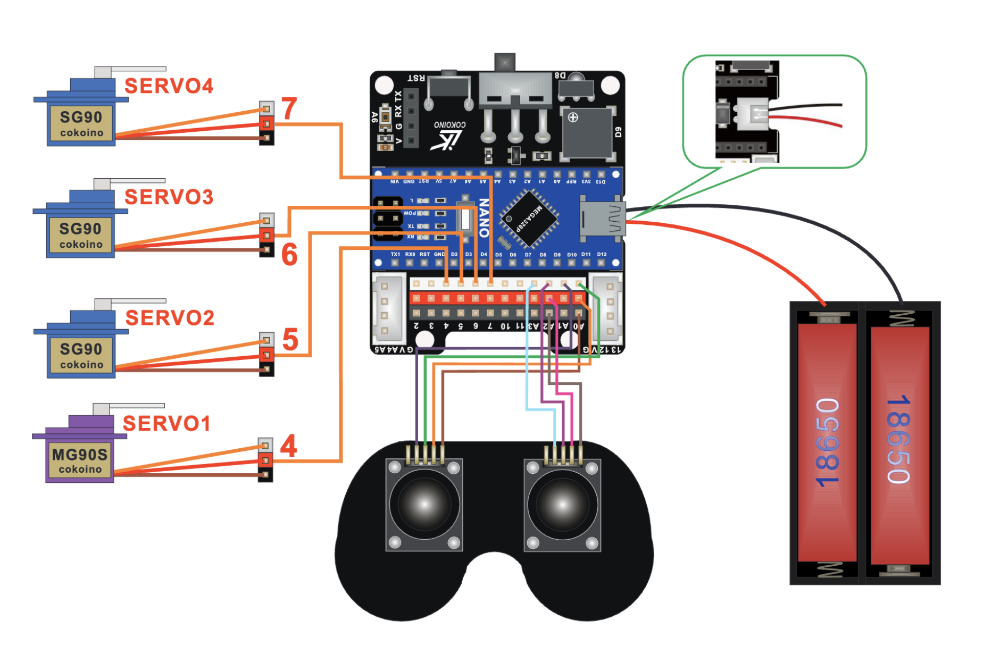
## Figure 2: Joystick Diagram
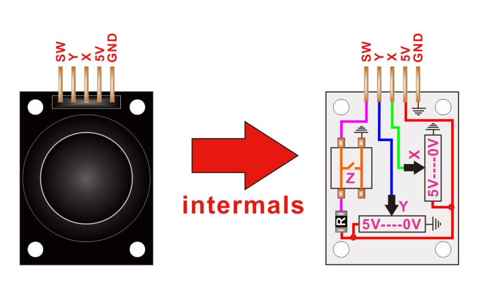
## Figure 3: Arduino Nano Diagram
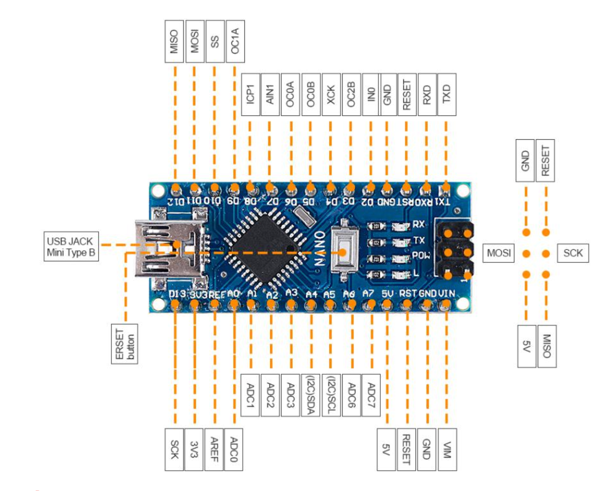
## Figure 3: Servos and Servo Wiring Diagrams
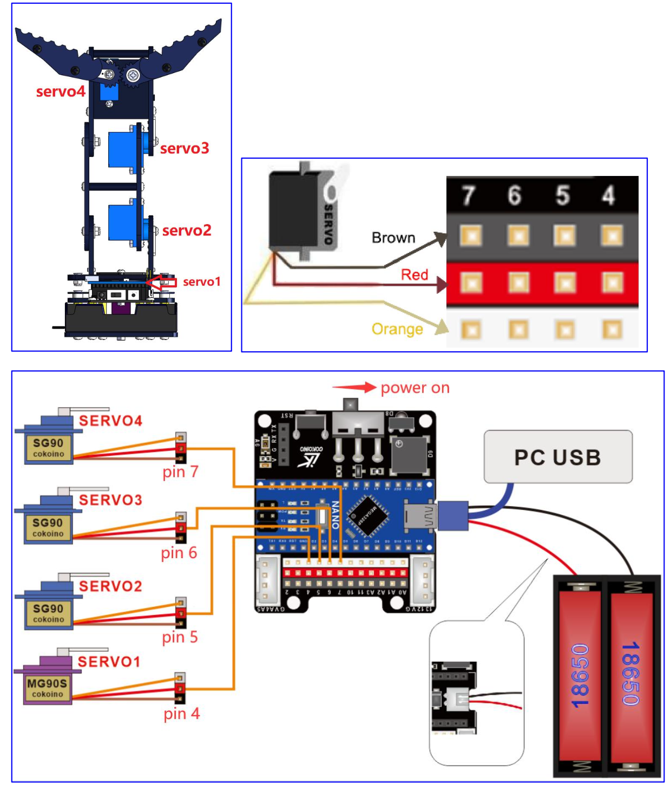
## Figure 4: Servo Diagram
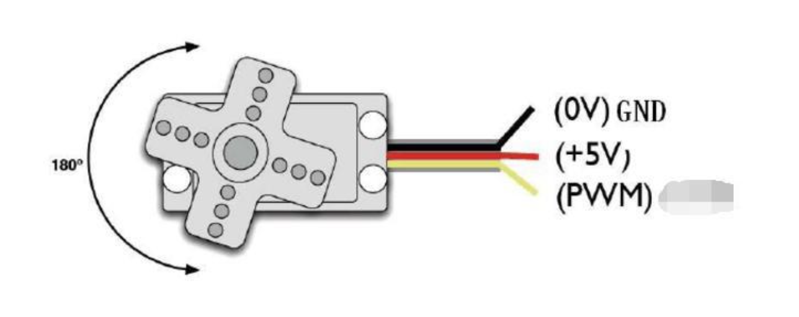
## Figure 5: More Servo Diagrams 
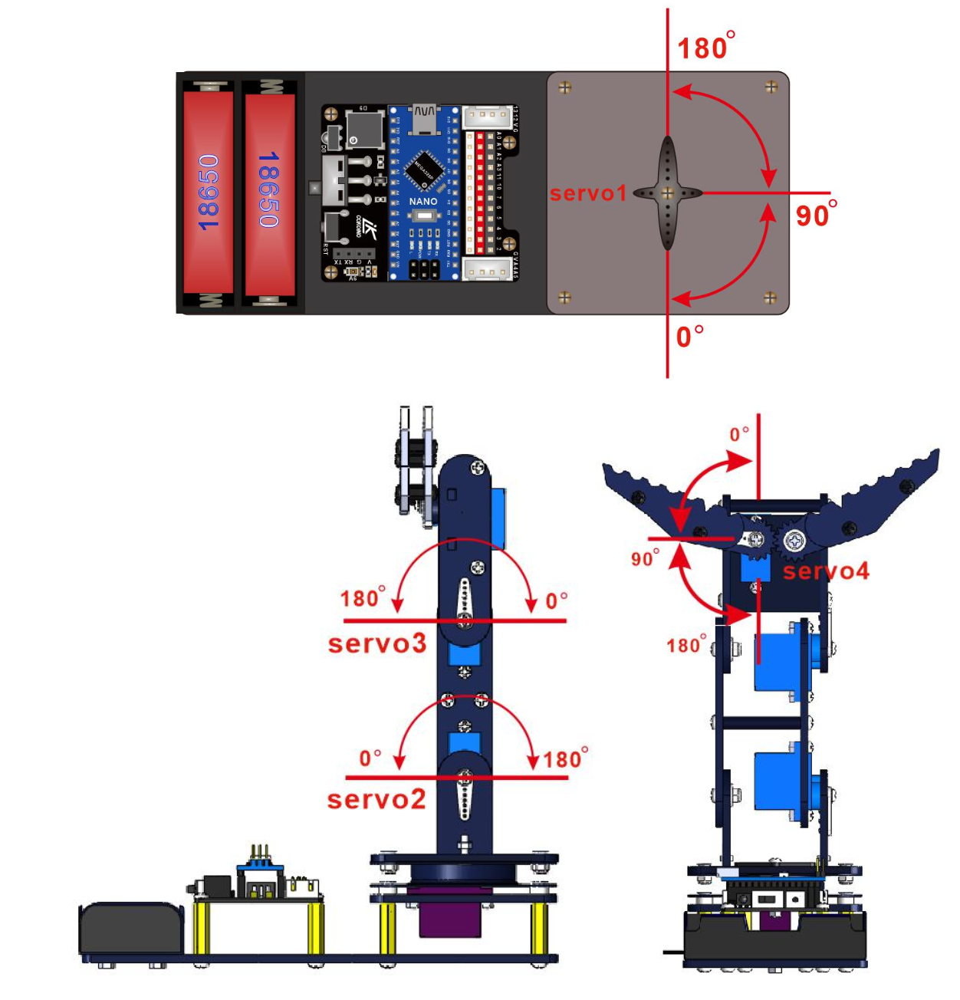
## Figure 6: Voice Control Wiring Diagram
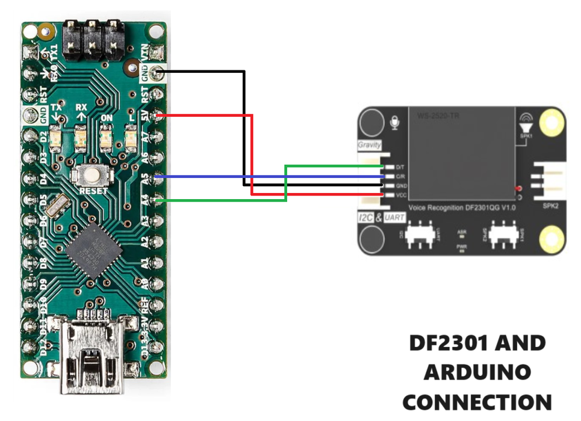
## Figure 7: Motor Driver Wiring Diagram
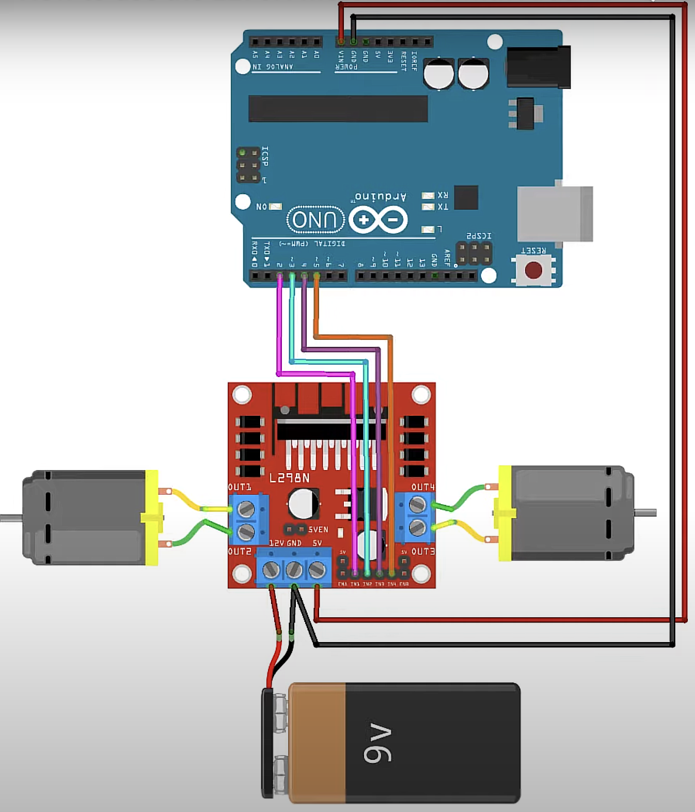
The figures 1-5 were from LK Cokoino. Figure 6 was from AutoDesk Instructables. Figure 7 was from a YouTube Tutorial by Ryan Chan.

<a id="code"></a>

# Final Code

```c++
#include "DFRobot_DF2301Q.h"
int motor1pin1 = 2;
int motor1pin2 = 3;
int motor2pin1 = 12;
int motor2pin2 = 13;
//I2C communication
DFRobot_DF2301Q_I2C DF2301Q;
int updown=0;
int leftright=0;
int openclose=0;
int forwardback=0;
int turnleftright = 0;
#include "src/CokoinoArm.h"
#include <SoftwareSerial.h>
#define buzzerPin 9
int state=0;
CokoinoArm arm;
int xL,yL,xR,yR;
SoftwareSerial BTSerial(10,11);
const int act_max=10;    //Default 10 action,4 the Angle of servo
int act[act_max][4];    //Only can change the number of action
int num=0,num_do=0;
void turnUD(void){
  if(xL!=512){
    if(0<=xL && xL<=100){arm.up(10);return;}
    if(900<xL && xL<=1024){arm.down(10);return;} 
    if(100<xL && xL<=200){arm.up(20);return;}
    if(800<xL && xL<=900){arm.down(20);return;}
    if(200<xL && xL<=300){arm.up(25);return;}
    if(700<xL && xL<=800){arm.down(25);return;}
    if(300<xL && xL<=400){arm.up(30);return;}
    if(600<xL && xL<=700){arm.down(30);return;}
    if(400<xL && xL<=480){arm.up(35);return;}
    if(540<xL && xL<=600){arm.down(35);return;} 
    }
}
void turnLR(void){
  if(yL!=512){
    if(0<=yL && yL<=100){arm.right(0);return;}
    if(900<yL && yL<=1024){arm.left(0);return;}  
    if(100<yL && yL<=200){arm.right(5);return;}
    if(800<yL && yL<=900){arm.left(5);return;}
    if(200<yL && yL<=300){arm.right(10);return;}
    if(700<yL && yL<=800){arm.left(10);return;}
    if(300<yL && yL<=400){arm.right(15);return;}
    if(600<yL && yL<=700){arm.left(15);return;}
    if(400<yL && yL<=480){arm.right(20);return;}
    if(540<yL && yL<=600){arm.left(20);return;}
  }
}
void turnCO(void){
  if(arm.servo4.read()>7){
    if(0<=xR && xR<=100){arm.close(0);return;}
    if(900<xR && xR<=1024){arm.open(0);return;} 
    if(100<xR && xR<=200){arm.close(5);return;}
    if(800<xR && xR<=900){arm.open(5);return;}
    if(200<xR && xR<=300){arm.close(10);return;}
    if(700<xR && xR<=800){arm.open(10);return;}
    if(300<xR && xR<=400){arm.close(15);return;}
    if(600<xR && xR<=700){arm.open(15);return;}
    if(400<xR && xR<=480){arm.close(20);return;}
    if(540<xR && xR<=600){arm.open(20);return;} 
    }
  else{arm.servo4.write(8);

  }  
}
void date_processing(int *x,int *y){
  if(abs(512-*x)>abs(512-*y))
    {*y = 512;}
  else
    {*x = 512;}
}
void buzzer(int H,int L){
  while(yR<420){
    digitalWrite(buzzerPin,HIGH);
    delayMicroseconds(H);
    digitalWrite(buzzerPin,LOW);
    delayMicroseconds(L);
    yR = arm.JoyStickR.read_y();
    }
  while(yR>600){
    digitalWrite(buzzerPin,HIGH);
    delayMicroseconds(H);
    digitalWrite(buzzerPin,LOW);
    delayMicroseconds(L);
    yR = arm.JoyStickR.read_y();
    }
}
void C_action(void){
  if(yR>800){
    int *p;
    p=arm.captureAction();
    for(char i=0;i<4;i++){
    act[num][i]=*p;
    p=p+1;     
    }
    num++;
    num_do=num;
    if(num>=act_max){
      num=0;
      buzzer(600,400);
      }
    while(yR>600){yR = arm.JoyStickR.read_y();}
    //Serial.println(act[0][0]);
  }
}
void Do_action(void){
  if(yR<220){
    buzzer(200,300);
    for(int i=0;i<num_do;i++){
      arm.do_action(act[i],15);
      }
    num=0;
    while(yR<420){yR = arm.JoyStickR.read_y();}
    for(int i=0;i<2000;i++){
      digitalWrite(buzzerPin,HIGH);
      delayMicroseconds(200);
      digitalWrite(buzzerPin,LOW);
      delayMicroseconds(300);        
    }
  }
}
void setup()
{
  pinMode(motor1pin1, OUTPUT);
  pinMode(motor1pin2, OUTPUT);
  pinMode(motor2pin1, OUTPUT);
  pinMode(motor2pin2, OUTPUT);
  Serial.begin(9600);
  BTSerial.begin(9600);
  //arm of servo motor connection pins
  arm.ServoAttach(4,5,6,7);
  //arm of joy stick connection pins : xL,yL,xR,yR
  arm.JoyStickAttach(A0,A1,A2,A3);
  pinMode(buzzerPin,OUTPUT);
  arm.servo1.write(90);
  arm.servo2.write(90);
  arm.servo3.write(90);
  arm.servo4.write(90);
  //Init the sensor
  while( !( DF2301Q.begin() ) ) {
    Serial.println("Communication with device failed, please check connection");
    delay(3000);
  }
  delay(1000);
  Serial.println("Begin ok!");

  /**
   * @brief Set voice volume
   * @param voc - Volume value(1~7)
   */
  DF2301Q.setVolume(13);

  Serial.print("Ok");

  /**
   * @brief Set mute mode
   * @param mode - Mute mode; set value 1: mute, 0: unmute
   */
  DF2301Q.setMuteMode(0);

  /**
   * @brief Set wake-up duration
   * @param wakeTime - Wake-up duration (0-255)
   */
  DF2301Q.setWakeTime(15);

  /**
   * @brief Get wake-up duration
   * @return The currently-set wake-up period
   */
  uint8_t wakeTime = 0;
  wakeTime = DF2301Q.getWakeTime();
  Serial.print("wakeTime = ");
  Serial.println(wakeTime);

  /**
   * @brief Play the corresponding reply audio according to the command word ID
   * @param CMDID - Command word ID
   * @note Can enter wake-up state through ID-1 in I2C mode
   */
  // DF2301Q.playByCMDID(1);   // Wake-up command
  //DF2301Q.playByCMDID(23);   // Common word ID
}

void loop(){
  /**
   * @brief Get the ID corresponding to the command word 
   * @return Return the obtained command word ID, returning 0 means no valid ID is obtained
   */
  uint8_t CMDID = 0;
  CMDID = DF2301Q.getCMDID();
  if(0 != CMDID) {
    Serial.print("CMDID = ");
    Serial.println(CMDID);
  }
//  DF2301Q.setVolume(20);
  switch (CMDID){
    case 5://first custom commmand
      Serial.println("arm up");
      updown = 1;
      break;
    case 6://second custom command
      Serial.println("arm down");
      updown = 2;
      break;
    case 7://third custom command
      Serial.println("arm left");
      leftright = 1;
      break;
    case 8://fourth custom command
      Serial.println("arm right");
      leftright = 2;
      break;
    case 9://fifth custom command
      Serial.println("arm open");
      openclose = 1;
      break;
    case 10://sixth custom command
      Serial.println("arm close");
      openclose = 2;
      break;
    case 11://seventh custom command
      Serial.println("arm reset");
      arm.servo1.write(90);
      arm.servo2.write(90);
      arm.servo3.write(90);
      arm.servo4.write(90);
      break;
    case 12://eigth custom command
      Serial.println("arm stop");
      updown = 0;
      leftright = 0;
      openclose = 0;
      break;
    case 13://ninth custom command
      Serial.println("car forward");
      forwardback = 1;
      break;
    case 14://tenth custom command
      Serial.println("car backward");
      forwardback = 2;
      break;
    case 15://eleventh custom command
      Serial.println("car stop");
      forwardback = 0;
      turnleftright = 0;
      break;
    case 16://twelfth custom command
      Serial.println("car left");
      turnleftright = 1;
      break;
    case 17://thirteenth custom command
      Serial.println("car right");
      turnleftright = 2;
      break;
    case 22://go forward
      Serial.println("forward");
      forwardback = 1;
      break;
    case 23://go backwards
      Serial.println("backwards");
      forwardback = 2;
      break;
    case 24://stop car
      Serial.println("Stop Car");
      forwardback = 0;
      turnleftright = 0;
      break;
    case 25://turn left
      Serial.println("Turn left");
      turnleftright = 1;
      break;
    case 26://turn left
      Serial.println("Turn left");
      turnleftright = 1;
      break;
    case 27://turn left
      Serial.println("Turn left");
      turnleftright = 1;
      break;
    case 29://turn right
      Serial.println("Turn right");
      turnleftright = 2;
      break;
    case 30://turn right
      Serial.println("Turn right");
      turnleftright = 2;
      break;
    case 82://reset the arm
      Serial.println("arm reset");
      arm.servo1.write(90);
      arm.servo2.write(90);
      arm.servo3.write(90);
      arm.servo4.write(90);
      break;
  }
  if(BTSerial.available()>0){
  state=BTSerial.read();
  }
  if(state==21){
    digitalWrite(motor1pin1, HIGH);//forwards
    digitalWrite(motor1pin2, LOW);
    digitalWrite(motor2pin1, HIGH);
    digitalWrite(motor2pin2, LOW);
  }
  if(state==22){
    digitalWrite(motor1pin1, HIGH);
    digitalWrite(motor1pin2, HIGH);
    digitalWrite(motor2pin1, HIGH);
    digitalWrite(motor2pin2, HIGH);
  }
  if(state==24){
    digitalWrite(motor1pin1, HIGH);
    digitalWrite(motor1pin2, HIGH);
    digitalWrite(motor2pin1, HIGH);
    digitalWrite(motor2pin2, HIGH);
  }
  if(state==26){
    digitalWrite(motor1pin1, HIGH);
    digitalWrite(motor1pin2, HIGH);
    digitalWrite(motor2pin1, HIGH);
    digitalWrite(motor2pin2, HIGH);
  }
  if(state==28){
    digitalWrite(motor1pin1, HIGH);//stop
    digitalWrite(motor1pin2, HIGH);
    digitalWrite(motor2pin1, HIGH);
    digitalWrite(motor2pin2, HIGH);
  }
  if(state==23){
    digitalWrite(motor1pin1, LOW);//backwards
    digitalWrite(motor1pin2, HIGH);
    digitalWrite(motor2pin1, LOW);
    digitalWrite(motor2pin2, HIGH);
  }
  if(state==25){
    digitalWrite(motor1pin1, HIGH);//turnleft
    digitalWrite(motor1pin2, LOW);
    digitalWrite(motor2pin1, HIGH);
    digitalWrite(motor2pin2, HIGH);    
  }
  if(state==27){
    digitalWrite(motor1pin1, HIGH);//turnright
    digitalWrite(motor1pin2, HIGH);
    digitalWrite(motor2pin1, HIGH);
    digitalWrite(motor2pin2, LOW);
  }
  if(state==1){
    arm.down(10);//moves arm up just says down
  }
  if(state==3){
    arm.up(10);//moves arm down just says up
  }
  if(state==5){
    arm.left(0);
  }
  if(state==7){
    arm.right(0);
  }
  if(state==9){
    arm.open(0);
  }
  if(state==11){
    arm.close(0);
  }
  if(state==13){
    arm.servo1.write(90);
    arm.servo2.write(90);
    arm.servo3.write(90);
    arm.servo4.write(90);
  }
  if(arm.servo4.read()<7){
    arm.servo4.write(8);
  }
  //Serial.println(state);
    xL = arm.JoyStickL.read_x();
  yL = arm.JoyStickL.read_y();
  xR = arm.JoyStickR.read_x();
  yR = arm.JoyStickR.read_y();
  date_processing(&xL,&yL);
  date_processing(&xR,&yR);
  turnUD();
  turnLR();
  turnCO();
  C_action();
  Do_action();
  if(updown==1){
    arm.down(40);//says move down but actually mvoes up
  }
  if(updown==2){
    arm.up(40);//says move up but acutally moves down
  }
  if(leftright==1){
    arm.left(20);
  }
  if(leftright==2){
    arm.right(20);
  }
  if(openclose==1){
    arm.open(20);
  }
  if(openclose==2){
    arm.close(20);
  }
  if(updown==0){
    arm.servo3.write(arm.servo3.read());
    arm.servo2.write(arm.servo2.read());
  }
  if(leftright==0){
    arm.servo1.write(arm.servo1.read());
  }
  if(openclose==0){
    arm.servo4.write(arm.servo4.read());
  }
  if(forwardback==1){
    digitalWrite(motor1pin1, HIGH);//forwards
    digitalWrite(motor1pin2, LOW);
    digitalWrite(motor2pin1, HIGH);
    digitalWrite(motor2pin2, LOW);
    delay(20);
    digitalWrite(motor1pin1, HIGH);//stop
    digitalWrite(motor1pin2, HIGH);
    digitalWrite(motor2pin1, HIGH);
    digitalWrite(motor2pin2, HIGH);
    delay(20);    
  }
  if(forwardback==2){
    digitalWrite(motor1pin1, LOW);//backwards
    digitalWrite(motor1pin2, HIGH);
    digitalWrite(motor2pin1, LOW);
    digitalWrite(motor2pin2, HIGH);
    delay(20);
    digitalWrite(motor1pin1, HIGH);//stop
    digitalWrite(motor1pin2, HIGH);
    digitalWrite(motor2pin1, HIGH);
    digitalWrite(motor2pin2, HIGH);
    delay(20);    
  }
  if(forwardback==0){
    digitalWrite(motor1pin1, HIGH);//stop
    digitalWrite(motor1pin2, HIGH);
    digitalWrite(motor2pin1, HIGH);
    digitalWrite(motor2pin2, HIGH);
  }
  if(turnleftright==1){
    digitalWrite(motor1pin1, HIGH);//turnleft
    digitalWrite(motor1pin2, LOW);
    digitalWrite(motor2pin1, HIGH);
    digitalWrite(motor2pin2, HIGH); 
    delay(30);
    digitalWrite(motor1pin1, HIGH);//stop
    digitalWrite(motor1pin2, HIGH);
    digitalWrite(motor2pin1, HIGH);
    digitalWrite(motor2pin2, HIGH);    
    delay(20);
  }
  if(turnleftright==2){
    digitalWrite(motor1pin1, HIGH);//turnright
    digitalWrite(motor1pin2, HIGH);
    digitalWrite(motor2pin1, HIGH);
    digitalWrite(motor2pin2, LOW);
    delay(30);
    digitalWrite(motor1pin1, HIGH);//stop
    digitalWrite(motor1pin2, HIGH);
    digitalWrite(motor2pin1, HIGH);
    digitalWrite(motor2pin2, HIGH);    
    delay(20);
  }
}  
```

This code is an updated version of the code above. Part of the updated part is borrowed from the DFRobot website from their tutorial and the other part I made on my own.     It includes the voice control that I added.

## Block Code

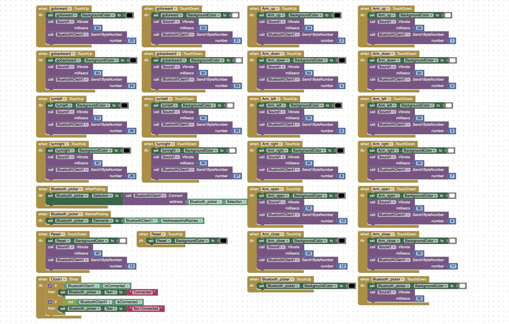

I made this code on my own and it is used for the app that controls the robotic arm via Bluetooth.

# Bill of Materials
<!---Here's where you'll list the parts of your project. To add more rows, just copy and paste the example below.
Don't forget to put the link Please don't buy each component inside the quotation marks in the corresponding row after href =. Follow the guide [here]([url](https://www.markdownguide.org/extended-syntax/)) to learn how to customize this to your project needs. -->

| **Part** | **Note** | **Price** | **Link** |
|:--:|:--:|:--:|:--:|
| Arduino Nano | Controlling all the parts of the arm | $18.93 | <a href="https://www.amazon.com/Arduino-Nano-Every-Single-Board/dp/B07VX7MX27?source=ps-sl-shoppingads-lpcontext&ref_=fplfs&smid=AA57DDZKZUZDL&th=1"> Link </a> |
| Arduino Shield | Extends capability of Arduino Nano | $4.99 | <a href="https://www.microcenter.com/product/632701/Nano_Shield_Board_w-_Power_Switch"> Link </a> |
| Bluetooth Module | Connecting the robot to the app to control it | $15.99 | <a href="https://www.amazon.com/dp/B07VL725T8/ref=as_li_ss_tl?asc_source=01H2RCFWP1ZMCBAR2FTHWM1SF1&ie=UTF8&language=en_US&linkCode=sl1&linkId=fdd96b8c1cdce0e711bfd234114b063e&tag=namespacebran507-20"> Link </a> |
| SG90 Servos | Rotating to move the robotic arm | $8.99 | <a href="https://www.amazon.com/Servo-Servos-Helicopter-Airplane-Controls/dp/B0BJQ2QTHG?source=ps-sl-shoppingads-lpcontext&ref_=fplfs&smid=A2QTZX14X1D97I&th=1"> Link </a> |
| MG90 Servo | Rotating the base of the robot | $19.99 | <a href="https://www.amazon.com/FPVDrone-Geared-Helicopter-Airplane-Controls/dp/B07P7P6FL4?source=ps-sl-shoppingads-lpcontext&ref_=fplfs&psc=1&smid=A1EGCWMH51R7JD"> Link </a> |
| Female to Female Jumper Wires | Connecting all the electric parts of the robot so they all get power | $5.49 | <a href="https://www.amazon.com/GenBasic-Piece-Female-Jumper-Wires/dp/B077NH83CJ?source=ps-sl-shoppingads-lpcontext&ref_=fplfs&smid=AAU5UPIIBDRLP&th=1"> Link </a> |
| PS2 Thumb Joystick Controller | Provides the user a way of input to control the robot | $2.00 | <a href="https://www.firgelli.com/products/ps2-thumb-joystick-controller?variant=39587692839110&currency=USD&utm_medium=product_sync&utm_source=google&utm_content=sag_organic&utm_campaign=sag_organic&srsltid=AfmBOoo9MoDs0a-YF9gyCvymNTjAXhv_4wPBSAWTyedzlEFcI2iK6A5u3P4"> Link </a> |
| Turntable | Allows the base of the robot to rotate freely | $9.95 | <a href="https://www.walmart.com/ip/44-lbs-Capacity-3-Swivel-Lazy-Susan-Turntable-Bearing/746423737?wmlspartner=wlpa&selectedSellerId=18079"> Link </a> |
| AA Batteries | Powering the entire robot | $15.48 | <a href="https://www.amazon.com/AmazonBasics-Performance-Alkaline-Batteries-Count/dp/B00MNV8E0C?source=ps-sl-shoppingads-lpcontext&ref_=fplfs&smid=ATVPDKIKX0DER&th=1"> Link </a> |
| Battery Slot Holder | Holding the batteries in place and taking their power | $1.62 | <a href="https://www.amazon.com/Battery-Holder-Storage-Boxes-Black/dp/B07KNT1TH4"> Link </a> |
| Screws and nuts | Holding together the robot | $38.99 | <a href="https://www.amazon.com/Deluxe-Hardware-Assortment-Professional-Washers/dp/B076CVQZWG?source=ps-sl-shoppingads-lpcontext&ref_=fplfs&psc=1&smid=A1C1KOESPL5YO9"> Link </a> |
| Columns | Holding up different parts of the robot | $11.99 | <a href="https://www.amazon.com/GeeekPi-Standoffs-Assortment-Box，Male-Female-Screwdriver/dp/B07PHBTTGV?source=ps-sl-shoppingads-lpcontext&ref_=fplfs&psc=1&smid=AOP0CH6UTUPHT"> Link </a> |
| WS-2520-TR | Recognizing voice to control the robot arm | $16.90 | <a href="https://www.dfrobot.com/product-2665.html?tracking=snqbbMs0lddTvr3eSVRKmzR6PWWGRVs9bZLm6dbDWV7auVnyVbcFCdESMTPnwDyr"> Link </a> |
| 2 Wheel Smart Car Kit | Wheels, Motors, Chassis, Universal Wheel, Screws, Nuts, and Spacers to create most of the physical part of the car | $17.95 | <a href="https://shop.barnabasrobotics.com/products/barnabas-rover-plastic-chassis-only-2-x-dc-motors-only"> Link </a> |
| 9 Volt battery | Powering the Car | $9.02 | <a href="https://www.amazon.com/Amazon-Basics-Performance-All-Purpose-Batteries/dp/B0774D64LT?source=ps-sl-shoppingads-lpcontext&ref_=fplfs&smid=ATVPDKIKX0DER&th=1"> Link </a> |
| Switch | Turn on and off the power of the car | $5.27 | <a href="https://www.amazon.com/Gardner-Bender-GSW-41-Electrical-Appliance/dp/B000BVZBPW?source=ps-sl-shoppingads-lpcontext&ref_=fplfs&smid=ATVPDKIKX0DER&th=1"> Link </a> |
| Male-Male Jumper Wires | Connecting all the electric parts of the robot so they all get power | $3.95 | <a href="https://www.digikey.com/en/products/detail/adafruit-industries-llc/759/5353615"> Link </a> |
| Male-Female Jumper Wires | Connecting all the electric parts of the robot so they all get power | $3.95 | <a href="https://www.digikey.com/en/products/detail/adafruit-industries-llc/826/5353622"> Link </a> |
| L298 Motor Driver | Controlling the motors to make the car move | $6.99 | <a href="https://www.amazon.com/Qunqi-Controller-Module-Stepper-Arduino/dp/B014KMHSW6"> Link </a> |

# Other Resources/Examples
- [Connecting Robot Arm To Bluetooth Using MIT App Inventor](https://www.instructables.com/Using-MIT-App-Inventor-to-Control-Arduino-the-Basi/)
- [Voice Control](https://wiki.dfrobot.com/SKU_SEN0539-EN_Gravity_Voice_Recognition_Module_I2C_UART)
- [Arduino Bluetooth Tutorial](https://howtomechatronics.com/tutorials/arduino/arduino-and-hc-05-bluetooth-module-tutorial/)

# Starter Project

<!---**Don't forget to replace the text below with the embedding for your milestone video. Go to YouTube, click Share -> Embed, and copy and paste the code to replace what's below.**-->

<iframe width="560" height="315" src="https://www.youtube.com/embed/syb-JsTi7dA?si=Cn6BqV8syKB3q4L7" title="YouTube video player" frameborder="0" allow="accelerometer; autoplay; clipboard-write; encrypted-media; gyroscope; picture-in-picture; web-share" referrerpolicy="strict-origin-when-cross-origin" allowfullscreen></iframe>

## Summary 

My starter project was the BlueStamp Arduino Starter. There is an Arduino Uno Board and Arduino Shield stacked on top of each other and they are connected to a breadboard with a circuit where a red LED light turns on when you press a button. It is meant to have one input of my choice: a switch, button, pressure sensor, and much more. And one output of my choice could be a motor or a light. The Arduino Uno Board came pre-built and I just had to connect wires to it, but I had to solder all the parts onto my Arduino Shield to build it. 

## Components Used

- 1 Arduino Uno: Controls everything
- 1 USB A->B cable: Connects the Arduino Uno to my laptop so I can code it
- 1 Arduino Proto Shield: Extends the capability of the Arduino Uno
- 1 Breadboard: Provides a space where all the wires can be connected
- 3 Buttons: 2 for the Arduino Proto Shield and one to turn on the light
- 3 LEDs: 2 for the Arduino Proto Shield and one to get turned on by the button
- 4 Resistors: Provides electrical resistance
- 2 Ceramic Capacitors: Mainly used for high stability performances and low-loss devices
- 2 8-pin female 0.1" headers (1*6): Added to the Arduino Shield to make it function
- 5 5-pin female 0.1" headers (1*8): Added to the Arduino Shield to make it function

##  Challenges Faced

The biggest challenge that I faced was trying to build the circuit on the breadboard and Arduino Uno becuase I had never done anything like it before so I didn't fully understand how a breadboard worked and how to make it so that I could put multiple circuits on one breadboard so that they would both work but not interfere with each other. Another challenge was mounting the Arduino Proto Shield onto the Arduino Uno because I had soldered the female pins on but they were a little bit offset so the female and male pins would not fit together. I had to solder it all again so that they would line up.

## Next Steps

I plan to start on my main project, the Phone-Controlled Robotic Arm. I have to build the arm, create a Bluetooth connection between the arm and the phone, code the arm so that the phone can make the arm work remotely, and add at least one modification.
